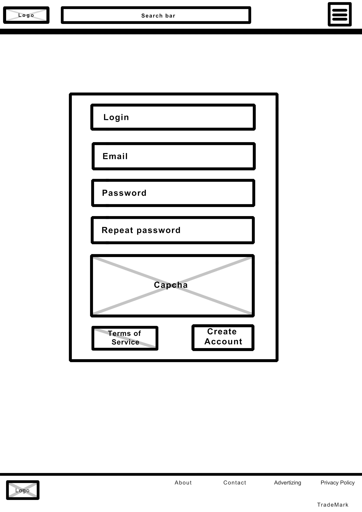

# Informações do Projeto
`TÍTULO DO PROJETO`  

Movie Sync

`CURSO` 

Ciência da Computação - PUC minas Coração Euncaristico

## Participantes

> Os membros do grupo são:

> - Arthur Martinho Medeiros Oliveira
> - Daniel Salgado Magalhães
> - Pedro Felipe Martins Oliveira
> - Pedro Ribeiro Maia

# Estrutura do Documento

- [Informações do Projeto](#informações-do-projeto)
  - [Participantes](#participantes)
- [Estrutura do Documento](#estrutura-do-documento)
- [Introdução](#introdução)
  - [Problema](#problema)
  - [Objetivos, justificativa e publico alvo](# Objetivos, Justificativa e Público-Alvo)
- [Especificações do Projeto](#especificações-do-projeto)
  - [Personas, Empatia e Proposta de Valor](#personas-empatia-e-proposta-de-valor)
  - [Histórias de Usuários](#histórias-de-usuários)
  - [Requisitos](#requisitos)
   - [Requisitos Funcionais](#requisitos-funcionais)
   - [Requisitos não Funcionais](#requisitos-não-funcionais)
  - [Restrições](#restrições)
- [Projeto de Interface](#projeto-de-interface)
  - [User Flow](#user-flow)
  - [Wireframes](#wireframes)
- [Metodologia](#metodologia)
  - [Divisão de Papéis](#divisão-de-papéis)
  - [Ferramentas](#ferramentas)
  - [Controle de Versão](#controle-de-versão)
- [**############## SPRINT 1 ACABA AQUI #############**](#-sprint-1-acaba-aqui-)
- [Projeto da Solução](#projeto-da-solução)
  - [Tecnologias Utilizadas](#tecnologias-utilizadas)
  - [Arquitetura da solução](#arquitetura-da-solução)
- [Avaliação da Aplicação](#avaliação-da-aplicação)
  - [Plano de Testes](#plano-de-testes)
  - [Ferramentas de Testes (Opcional)](#ferramentas-de-testes-opcional)
  - [Registros de Testes](#registros-de-testes)
- [Referências](#referências)

# Introdução

## Problema

Com o aumento da popularidade de
serviços de streaming devido a quarentena e a diversificação de
meios para se assistir um conteúdo, as pessoas tendem a procurar
por entretenimento via web, porém muitas vezes sem sucesso.
Com isso tem-se a necessidade de fornecer um local mais conciso
em que as informações necessárias possam ser achadas

## Objetivos, Justificativa e Público-Alvo

O objetivo do projeto é criar
um lugar para aqueles que gostam de filmes e séries, onde possam
ter acesso a informações sobre suas obras preferidas, desde onde
assisti-las até à críticas e notas do público, tudo em um só lugar. O
projeto será um site em que o usuário consiga com mais facilidade
achar as buscas que procura, tendo como público-alvo um público
mais jovem e conectado.
 

## Personas, Empatia e Proposta de Valor

 

 
 

## Histórias de Usuários

Com base na análise das personas forma identificadas as seguintes histórias de usuários:

|EU COMO... `PERSONA`| QUERO/PRECISO ... `FUNCIONALIDADE` |PARA ... `MOTIVO/VALOR`                 |
|--------------------|------------------------------------|----------------------------------------|
|Jorge               | Ler Criticas de outros usuários    | Encontrar e conhecer novos filmes      |
|Pamela              | Facilidade para achar o que gosta  | Ter mais tempo para sí no dia a dia    |

## Requisitos

As tabelas que se seguem apresentam os requisitos funcionais e não funcionais que detalham o escopo do projeto.

### Requisitos Funcionais

|ID    | Descrição do Requisito  | Prioridade |
|------|-----------------------------------------|----|
|RF-001| O sistema deverá cadastrar o usuário | BAIXA | 
|RF-002| O usuário deverá conseguir gerar uma senha para sua conta | ALTA |
|RF-003| Ter imagens dos conteúdos | MÉDIA | 
|RF-004| O sistema deve ser capaz de deixar o usuário alterar seus dados | ALTA | 
|RF-005| O sistema deve operar 24/7 | ALTA | 
|RF-006| O sistema deve ser capaz de lidar com o alto tráfego de
usuários | ALTA | 
|RF-007| O usuário deve conseguir alterar suas listas de marcações | MÉDIA | 
|RF-008| O sistema deverá mostrar uma aba de pesquisa que pode ser
digitada ou marcada por tags | ALTA | 

### Requisitos não Funcionais

|ID     | Descrição do Requisito  |Prioridade |
|-------|-------------------------|----|
|RNF-001| Ter modo claro e escuro | BAIXA | 
|RNF-002| Ter portabilidade mobile |  BAIXA | 
|RNF-003| Tempo de resposta <1seg | MÉDIA |
|RNF-004| O sistema deve ser compatível com Windows XP, Vista, 7, 8,
10, 11 e MacOS | BAIXA |
|RNF-005| O usuário deve conseguir alterar os comentários feitos | MÉDIA |
|RNF-006| O sistema poderá avisar sobre novos conteúdos que possam
interessar o usuário | MÉDIA |
|RNF-007| O sistema poderá mudar o fundo da página de acordo com o
conteúdo acessado | BAIXA |
 

## Restrições

O projeto está restrito pelos itens apresentados na tabela a seguir.

|ID| Restrição                                             |
|--|-------------------------------------------------------|
|01| O projeto deverá ser entregue até o final do semestre |
|02| Não pode ser desenvolvido um módulo de backend        |

## User Flow

> 

## Wireframes

>  **Tela Principal**:
> 
>
>  **Tela Login**:
> 
>
>  **Tela Criação De Conta**:
> 
>
>  **Tela Profile**:
> 
>
>  **Tela Obra**:
> 

# Metodologia

......   ......

> Nesta parte do documento, você deve apresentar a metodologia 
> adotada pelo grupo, descrevendo o processo de trabalho baseado nas metodologias ágeis, 
> a divisão de papéis e tarefas, as ferramentas empregadas e como foi realizada a
> gestão de configuração do projeto via GitHub.
>
> Coloque detalhes sobre o processo de Design Thinking e a implementação do Framework Scrum seguido
> pelo grupo. O grupo poderá fazer uso de ferramentas on-line para acompanhar
> o andamento do projeto, a execução das tarefas e o status de desenvolvimento
> da solução.
> 
> **Links Úteis**:
> - [Tutorial Trello](https://trello.com/b/8AygzjUA/tutorial-trello)
> - [Gestão ágil de projetos com o Trello](https://www.youtube.com/watch?v=1o9BOMAKBRE)
> - [Gerência de projetos - Trello com Scrum](https://www.youtube.com/watch?v=DHLA8X_ujwo)
> - [Tutorial Slack](https://slack.com/intl/en-br/)

## Divisão de Papéis

- Arthur - design e apresentação do slide, ideia de personas
- Daniel - pesquisa, organização de ideias, contexto e especificação
do projeto, montagem do protótipo interativo, processo de
design thinking
- Pedro Felipe - formatação do wireframe, design do wireframe,
processo de design thinking, montagem do protótipo interativo
- Pedro Ribeiro - organização de ideias, colaborador do projeto,
processo de design thinking

## Ferramentas

......    ......

| Ambiente  | Plataforma              |Link de Acesso |
|-----------|-------------------------|---------------|
|Processo de Design Thinkgin  | Miro |  https://miro.com/XXXXXXX | 
|Repositório de código | GitHub | https://github.com/XXXXXXX | 
|Hospedagem do site | Heroku |  https://XXXXXXX.herokuapp.com | 
|Protótipo Interativo | Figma | https://figma.com/XXXXXXX | 

>
> Liste as ferramentas empregadas no desenvolvimento do
> projeto, justificando a escolha delas, sempre que possível.
> 
> As ferramentas empregadas no projeto são:
> 
> - Editor de código.
> - Ferramentas de comunicação
> - Ferramentas de diagramação
> - Plataforma de hospedagem
> 
> O editor de código foi escolhido porque ele possui uma integração com o
> sistema de versão. As ferramentas de comunicação utilizadas possuem
> integração semelhante e por isso foram selecionadas. Por fim, para criar
> diagramas utilizamos essa ferramenta por melhor captar as
> necessidades da nossa solução.
> 
> **Links Úteis - Hospedagem**:
> - [Getting Started with Heroku](https://devcenter.heroku.com/start)
> - [Crie seu Site com o HostGator](https://www.hostgator.com.br/como-publicar-seu-site)
> - [GoDady](https://br.godaddy.com/how-to)
> - [GitHub Pages](https://pages.github.com/)

## Controle de Versão

......   ......

> Discuta como a configuração do projeto foi feita na ferramenta de
> versionamento escolhida. Exponha como a gerência de tags, merges,
> commits e branchs é realizada. Discuta como a gerência de issues foi
> realizada.
> A ferramenta de controle de versão adotada no projeto foi o
> [Git](https://git-scm.com/), sendo que o [Github](https://github.com)
> foi utilizado para hospedagem do repositório `upstream`.
> 
> O projeto segue a seguinte convenção para o nome de branchs:
> 
> - `master`: versão estável já testada do software
> - `unstable`: versão já testada do software, porém instável
> - `testing`: versão em testes do software
> - `dev`: versão de desenvolvimento do software
> 
> Quanto à gerência de issues, o projeto adota a seguinte convenção para
> etiquetas:
> 
> - `bugfix`: uma funcionalidade encontra-se com problemas
> - `enhancement`: uma funcionalidade precisa ser melhorada
> - `feature`: uma nova funcionalidade precisa ser introduzida
>
> **Links Úteis**:
> - [Tutorial GitHub](https://guides.github.com/activities/hello-world/)
> - [Git e Github](https://www.youtube.com/playlist?list=PLHz_AreHm4dm7ZULPAmadvNhH6vk9oNZA)
> - [5 Git Workflows & Branching Strategy to deliver better code](https://zepel.io/blog/5-git-workflows-to-improve-development/)
>
> **Exemplo - GitHub Feature Branch Workflow**:
>
> 

# **############## SPRINT 1 ACABA AQUI #############**

# Projeto da Solução

......  COLOQUE AQUI O SEU TEXTO ......

## Tecnologias Utilizadas

......  COLOQUE AQUI O SEU TEXTO ......

> Descreva aqui qual(is) tecnologias você vai usar para resolver o seu
> problema, ou seja, implementar a sua solução. Liste todas as
> tecnologias envolvidas, linguagens a serem utilizadas, serviços web,
> frameworks, bibliotecas, IDEs de desenvolvimento, e ferramentas.
> Apresente também uma figura explicando como as tecnologias estão
> relacionadas ou como uma interação do usuário com o sistema vai ser
> conduzida, por onde ela passa até retornar uma resposta ao usuário.
> 
> Inclua os diagramas de User Flow, esboços criados pelo grupo
> (stoyboards), além dos protótipos de telas (wireframes). Descreva cada
> item textualmente comentando e complementando o que está apresentado
> nas imagens.

## Arquitetura da solução

......  COLOQUE AQUI O SEU TEXTO E O DIAGRAMA DE ARQUITETURA .......

> Inclua um diagrama da solução e descreva os módulos e as tecnologias
> que fazem parte da solução. Discorra sobre o diagrama.
> 
> **Exemplo do diagrama de Arquitetura**:
> 
> 

# Avaliação da Aplicação

......  COLOQUE AQUI O SEU TEXTO ......

> Apresente os cenários de testes utilizados na realização dos testes da
> sua aplicação. Escolha cenários de testes que demonstrem os requisitos
> sendo satisfeitos.

## Plano de Testes

......  COLOQUE AQUI O SEU TEXTO ......

> Enumere quais cenários de testes foram selecionados para teste. Neste
> tópico o grupo deve detalhar quais funcionalidades avaliadas, o grupo
> de usuários que foi escolhido para participar do teste e as
> ferramentas utilizadas.
> 
> **Links Úteis**:
> - [IBM - Criação e Geração de Planos de Teste](https://www.ibm.com/developerworks/br/local/rational/criacao_geracao_planos_testes_software/index.html)
> - [Práticas e Técnicas de Testes Ágeis](http://assiste.serpro.gov.br/serproagil/Apresenta/slides.pdf)
> -  [Teste de Software: Conceitos e tipos de testes](https://blog.onedaytesting.com.br/teste-de-software/)

## Ferramentas de Testes (Opcional)

......  COLOQUE AQUI O SEU TEXTO ......

> Comente sobre as ferramentas de testes utilizadas.
> 
> **Links Úteis**:
> - [Ferramentas de Test para Java Script](https://geekflare.com/javascript-unit-testing/)
> - [UX Tools](https://uxdesign.cc/ux-user-research-and-user-testing-tools-2d339d379dc7)

## Registros de Testes

......  COLOQUE AQUI O SEU TEXTO ......

> Discorra sobre os resultados do teste. Ressaltando pontos fortes e
> fracos identificados na solução. Comente como o grupo pretende atacar
> esses pontos nas próximas iterações. Apresente as falhas detectadas e
> as melhorias geradas a partir dos resultados obtidos nos testes.

# Referências

- [IMDB](https://www.imdb.com/)
- [Netflix](https://www.netflix.com)
- [MAL-Sync(extenção)](https://malsync.moe/)

> **Links Úteis**:
> - [Formato ABNT](https://www.normastecnicas.com/abnt/trabalhos-academicos/referencias/)
> - [Referências Bibliográficas da ABNT](https://comunidade.rockcontent.com/referencia-bibliografica-abnt/)
